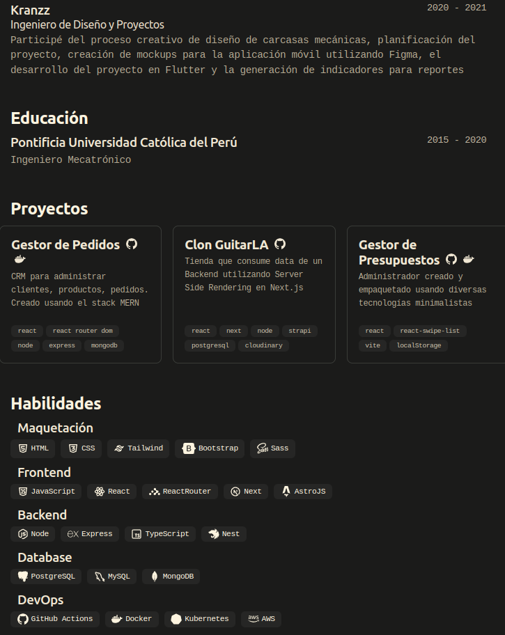

    <h2>
        CV minimalista
    </h2>
    

        Basado en el diseño de <a href="https://github.com/BartoszJarocki/cv">Bartosz Jarocki</a>
    

</img>

## 📜 Descripción

- El proyecto original fue hecho en **Next.js**. Se utilizó **Ninja Keys** para crear atajos de teclado.
- Este resumen fue recreado en **Astro** y **Typescript**, pues no se requiere potencia en el routing, sino más bien un sitio estático
- Se agregó **imágenes svg** tanto en el Hero como en los Skills
- Además, se añadió un modelo de **cv_english.json** listo para modificar la data e imprimir el *resume*.
- Finalmente, el código final fue desplegado en [**GitHub Pages**], un hosting apropiado para páginas estáticas.

## 🚀 Empezar

### **Versión Online**

Usa este [enlace](https://deglan-rivas.github.io/frontend-astro-portafolio/ "Revisar CV") para revisar los enlaces del código desplegado en GitHub Pages.